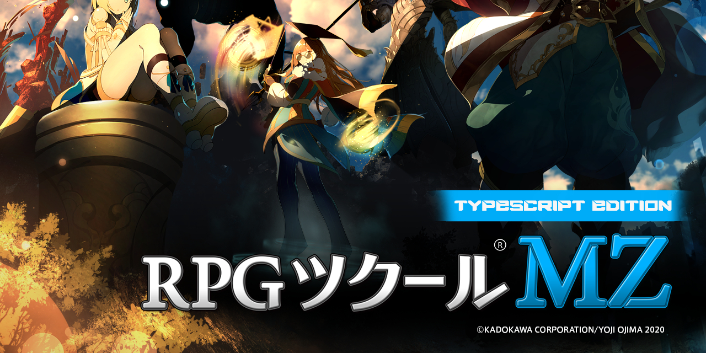

# Introduction

This project provides type definitions for the whole MZ codebase allowing the
programmer to create plugins for rpg maker MZ using Typescript.


# Getting Started

The project can be installed via NPM, both via the default NPM registry and the
Github NPM Registry:

    npm install rmmz@github:@niokasgami/rpg-maker-mz-typescript

All types are available from the top-level module:

```ts
import { DataManager, $gameParty, Game_Character } from 'rmmz';
```

## Configure with Rollup.js

All you need is to set `external: ["rmmz"]` and `output.globals.rmmz: "window"`
in `rollup.config.js`.


# Contributing

You can contribute to the project by any means! To install all the project
development dependencies, run:

    npm install

As the project is open to contribution there's specific rules to follow :

- All classes must be declared then exported separately, at the end of the
  file:

    ```ts
    declare class Dummy {
        // ...
    }

    export { Dummy };
    ```

- To support importing classes from modules, you must always include an
  `export` directive for each class you declare on the respective `index.d.ts`
  file for the module it belongs to:

  ```ts
  // lib/module/index.d.ts

  export * from "./class";
  ```

- Always import classes from the module index, never by the class file:

  ```ts
  // Do
  import { Game_Temp } from "../rmmz_objects";

  // Don't
  import { Game_Temp } from "../rmmz_objects/Game_Temp";
  ```

  This is important to make sure circular dependencies are resolved correctly,
  and also to ensure every class is exported on the module it belongs to.

- Always follow linter suggestions, specially ones that concern the type
  definitions (e.g. not using `any`, `Function` and other unrestrictive types).


# Terms of Use

Please read the [license information](./LICENSE) for this repository.
